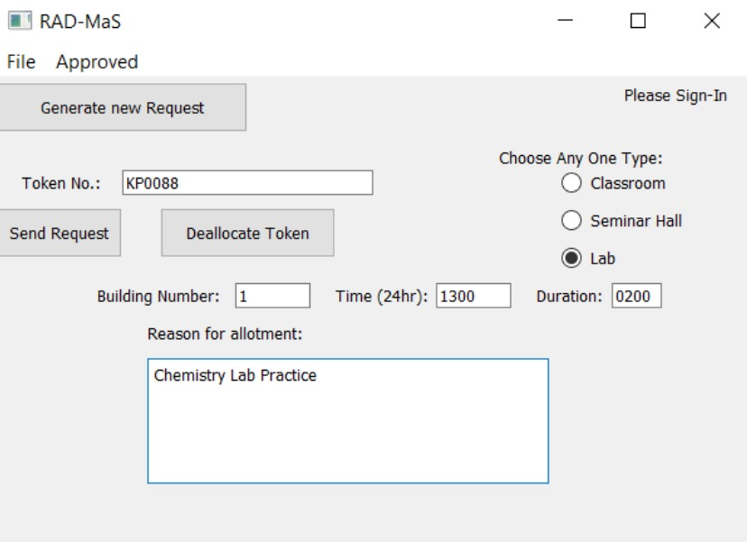

# robotick_sd3

by Atharv Sapre, Atharva Vaidya

# About

### <u>Group Details</u>

Group Name: Robotick

| S.No | Name           | Email ID                  |
|:----:|:--------------:|:-------------------------:|
| 1    | Atharv Sapre   | atharvasapre22@gmail.com  |
| 2    | Atharva Vaidya | atharva16vaidya@gmail.com |

### <u>Problem Statement</u>

To design a system for finding and managing room availability within the campus for college activities

### <u>Idea Title</u>

RAD-MaS

# Usage

Run either of the following two commands in a shell.

```
python user_ui.py
python3 user_ui.py
```



1. Go to File -> Sign In and enter the username and password to sign in

2. Click "Generate new Request" to generate a token number.

3. Choose the type of classroom you want to book, the desired building number, the start time (in HHMM) and duration (again in HHMM).

4. Enter a reason for allotment, then click "Send Request".
